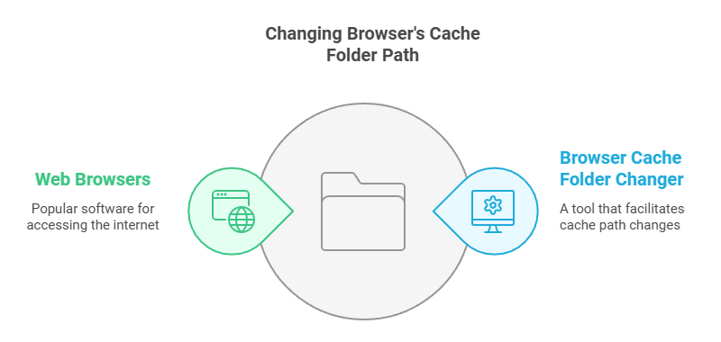

# Web Browser Cache Folder Changer
**This repository distributes a Windows application that allows us to change the web browser's cache folder path.**

* User Guide
    * [Browser Cache Folder Changer User Guide](https://github.com/kmscom/Browser-Cache-Folder-Changer/blob/main/User%20Guide/User%20Guide.md)
    * [Browser Cache Folder Changer 사용자 가이드](https://github.com/kmscom/Browser-Cache-Folder-Changer/blob/main/User%20Guide/User%20Guide%20-%20KOR.md)
* [Copyright](https://github.com/kmscom/Browser-Cache-Folder-Changer/blob/main/Release/LICENSE.txt)

# What does Browser Cache Folder Changer do?
This program redirects the browser's cache folder to a new folder, which is usually located on the RAM disk drive.
Use this application at your own risk. This application DOES NOT SUPPORT any issue caused by this program.

For the technical details, refer to the following link.
* [Moving Chrome cache folder?](https://superuser.com/questions/866016/moving-chrome-cache-folder)

# What is web browser cache?
Web browser cache is a mechanism that temporarily stores web page resources (HTML, CSS, JavaScript, images, etc.) on a user's computer to use stored files without re-downloading them from the server when revisiting the same web page. This improves web page loading speed, reduces network traffic, and reduces server load.

Here is how the web browser cache works.
* **First Request:** The first time a user visits a web page, the browser downloads all the necessary resources from the web server. At the same time, the web server provides information about how the browser will cache resources, including Cache-Control headers, Expires headers, ETag, Last-Modified headers, and so on in its responses.
* **Store Resources:** Downloaded resources are stored in the browser's cache directory. The type and duration of storage of resources is determined by header information sent from the web server.
* **Next Request:** When a user revisits the same web page, the browser first checks to see if any resources are stored in the cache.
    * **Cache Hit Case:** If the resources stored in the cache are valid (unexpired), the browser quickly loads web pages using the cached resources without requesting the server.
    * **Cache Miss Case:** If no or expired resources are stored in the cache, the browser requests the web server again to download the resources and stores the new resources in the cache.
        * The server then uses the Last-Modified or ETag header to verify that the resources have been changed and, if not, returns a 304 Not Modified status code to prevent unnecessary data transfer.

# Why should you change web browser's cache folder to the RAM Drive?
By redirecting the cache folder to a RAM disk drive,
* You can run the web browser faster.
* You can reduce IO on your disk. If you are using an SSD, this may help to increase the lifetime of it.

For more details, refer [here](https://github.com/kmscom/Browser-Cache-Folder-Changer/wiki).

If your RAM disk drive supports data backup and restore through the power cycle, the cache data will be persistent.

Otherwise, the cache data will be lost. Even when the RAM disk drive supports data backup and restores through the power cycle, the browser cache data can be lost if a sudden power off happens.

# How to setup the RAM Drive at Windows?
Here are some famous RAM disk drive applications for Windows.

* [ImDisk](https://sourceforge.net/projects/imdisk-toolkit/)
* [AMD Radeon(TM) RAMDisk](https://www.radeonramdisk.com/software_downloads.php)

# What web browsers are supported by the Browser Cache Folder Changer?
This application supports the following web browsers.

* [Brave](https://brave.com/)
* [Google Chrome](https://www.google.com/)
* [Microsoft Edge](https://www.microsoft.com/edge/)
* [Naver Whale](https://whale.naver.com/)
* [Epic Browser](https://epicbrowser.com/)
* [Opera](https://www.opera.com/)
* [Opera GX](https://www.opera.com/gx)
* [Vivaldi](https://vivaldi.com/)

# Relerated sites
You can find the related information at the following sites.

* [Moving Chrome cache folder?](https://superuser.com/questions/866016/moving-chrome-cache-folder/1863614#1863614)
* [How to Change the Google Chrome Cache Location](https://www.simplehelp.net/2010/11/16/how-to-change-the-google-chrome-cache-location/)
* [How to Change Google Chrome Cache Location in Windows](https://www.windowsdigitals.com/how-to-change-google-chrome-cache-location-in-windows-11-10/)
* [How to Change the Google Chrome Cache Location](https://www.shareus.com/web/how-to-change-the-google-chrome-cache-location.html)

# Acknowledgement
The figures in this page are created by [Napkin.ai](https://www.napkin.ai/).