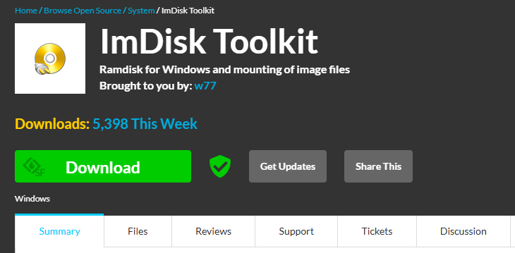
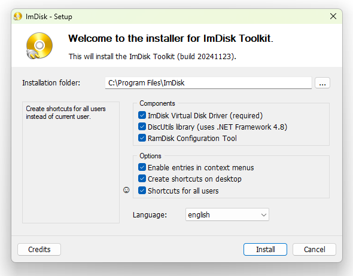
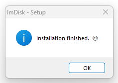
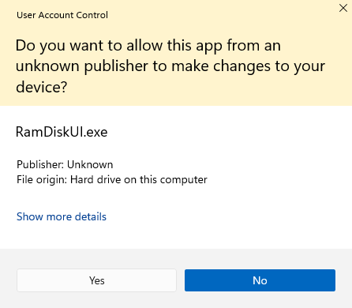
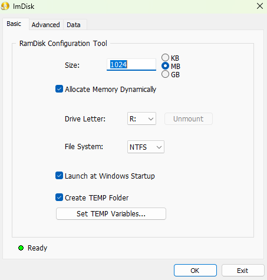
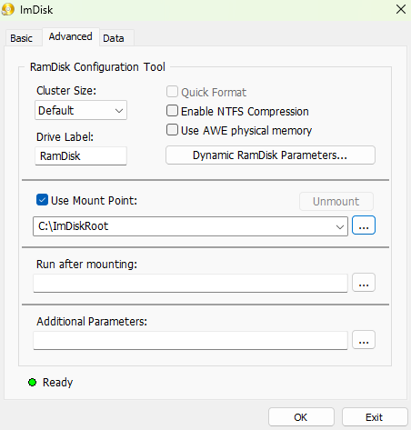
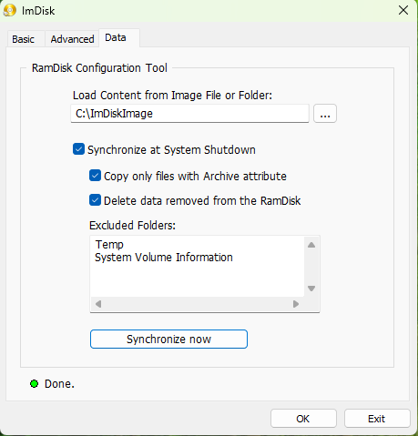

# ImDisk 툴킷 램 디스크 프로그램 설치 가이드

[ImDisk Toolkit](https://sourceforge.net/projects/imdisk-toolkit/) 프로그램의 설치 가이드이다.
Windows 10, 11 시스템에서 램 디스크를 지원한다.

## 프로그램 다운로드

ImDisk 툴킷 프로그램은 다음 링크에서 다운로드 받을 수 있다.

*   [ImDisk Toolkit at SourceForge.net](https://sourceforge.net/projects/imdisk-toolkit/)

- "Download" 버튼을 클릭해서 프로그램을 다운로드 받는다.
    - ImDiskTk-x64.zip

## 프로그램 설치
1. 다운로드 받은 프로그램 파일을 압축 해제하고, "Install.bat" 파일을 실행한다.

- 이 프로그램은 램 디스크 설치를 위해 privilege 권한을 필요로 한다.
- "Yes" 버튼을 클릭해서 진행한다.

2. 다음과 같이 체크 박스를 선택하고, "Install" 버튼을 클릭해서 진행한다.

- 다음과 같은 윈도우가 나타나며 설치가 성공할 것이다.

- 바탕화면에 다음과 같이 3개의 아이콘이 저장되어 있을 것이다.

## 램 디스크 설정하기
ImDisk 툴킷을 설치한 후에 램 드라이브 설정을 해야 한다.

1) 위의 3개 아이콘들 중 "RamDisk Configuration" 아이콘을 클릭해서 ImDisk 툴킷의 설정을 시작한다.
- 이 프로그램은 privilege 권한을 필요로 한다. "Yes" 버튼을 클릭해서 진행한다.

2) 'Basic' 탭을 선택하고, 다음과 같이 설정한다.
- 램 디스크의 크기는 희망하는 만큼 적절한 크기로 설정한다.
- 보통 웹 브라우져 하나당 150MiB 정도를 설정한다고 가정하면 적절하다.

램 드라이브를 설정하는 방법은 3A), 3B) 두 가지이다. 

3A) "Advanced" 탭을 클릭하고, 다음과 같이 설정한다 (추천).
- 이 경우 램 디스크가 "R:\" 드라이브에 마운트 된다.

- 위와 같이 설정하면 앞으로 "R:\" 드라이브에 저장되는 파일은 램 디스크에 저장된다.
  
3B) "Advanced" 탭을 클릭하고, 다음과 같이 설정한다.
- "C:\ImDiskRoot" 폴더를 생성한다.
- 'Use Mount Point:' 체크 박스를 선택하고, "C:\ImDiskRoot" 폴더로 지정한다.

- 위와 같이 설정하면 앞으로 "C:\ImDiskRoot\" 폴더 아래에 생성되는 파일은 램 디스크에 저장된다.

4) "Data" 탭을 선택하고, 다음과 같이 설정한다.
- "C:\ImDiskImage" 폴더를 생성한다.
- "Load Content from Image File or Folder:" 아래, 우측에 있는 ... 버튼을 눌러서 다음과 같이 선택한다.

체크 박스를 다음과 같이 선택하고, "Synchronize now" 버튼을 클릭한다.

위와 같이 설정하면 컴퓨터를 종료할 때 램 디스크의 내용을 "C:\ImDiskImage\" 폴더 아래에 저장했다가,
컴퓨터를 다시 시작할 때 "C:\ImDiskImage\" 폴더의 내용을 램 디스크로 다시 복원한다.

5) "OK" 버튼을 눌러 설정을 마무리 한다.
- 다음과 같은 윈도우가 나타날 것이다.

- "OK" 버튼을 클릭해서 램 드라이브를 포맷한다.
  
6) "Exit" 버튼을 눌러 ImDisk 설정 프로그램을 종료한다.

이제, "R:\" 드라이브나 "C:\ImDiskRoot\"를 통해 램 디스크를 사용할 수 있다.

