# ImDisk Toolkit RAM Disk Application Install Guide

Here is an example installation guide of [ImDisk Toolkit.](https://sourceforge.net/projects/imdisk-toolkit/)

## Download

You can download the latest ImDisk Toolkit application from the following link.

*   [ImDisk Toolkit at SourceForge.net](https://sourceforge.net/projects/imdisk-toolkit/)

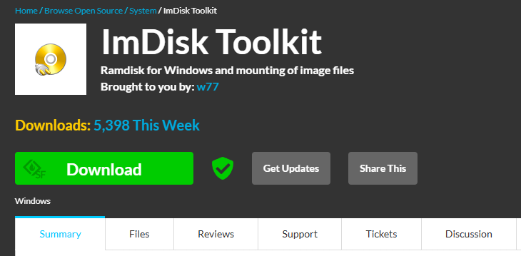

Click "Download" button to download
- ImDiskTk-x64.zip

## Install
Uncompress and run "Install.bat" file.

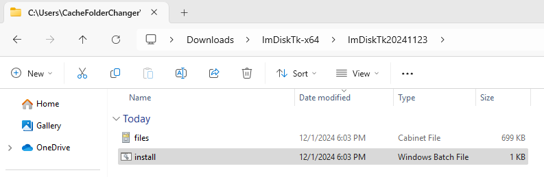

As this program needs privilege permission, following window will appear.
Press "Yes" button to proceed.

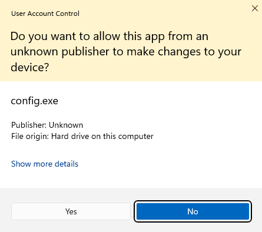

Select checkboxes as follows.

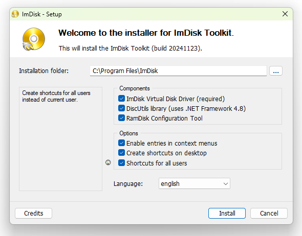

Install will be completed successfully.

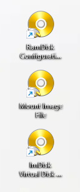

## Configure RAM Disk
1) Among the three icons, click "RamDisk Configuration" icon to start the ImDisk configuration.
This program needs privilege permission. Click "Yes" to continue.

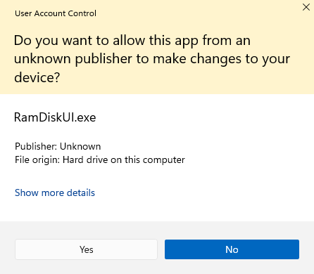

2) Set the 'Basic' tab as follows.
You may change the size of DRAM disk size as you want.

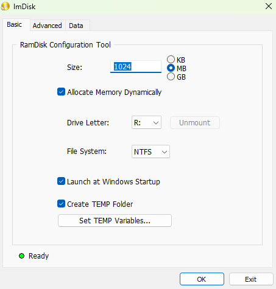

3) Set the 'Advanced' tab as follows.

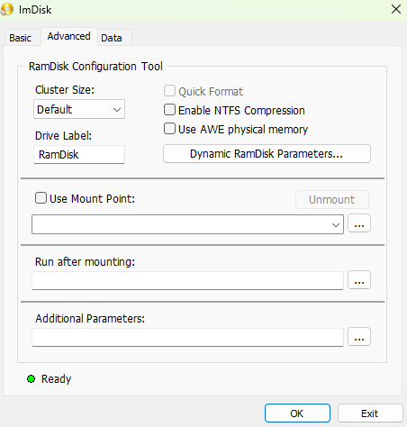

In this case, RAM disk is mapped to "R:\" drive.

4) Set the 'Data' tab as follows.
Create "C:\ImDiskImage" folder and select it as follows.

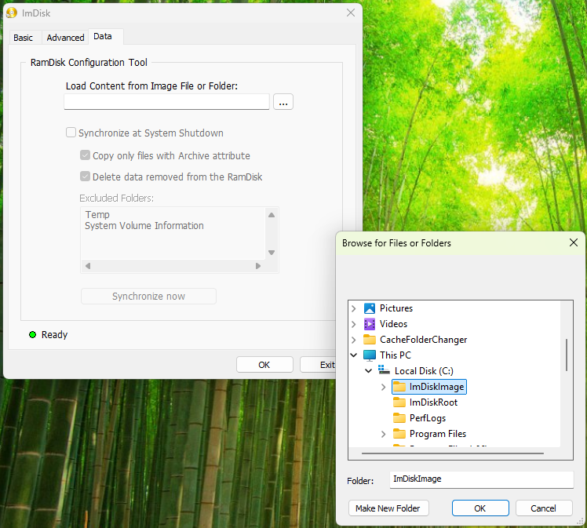

Check the checkboxes as follows and click "Synchronize now" button.

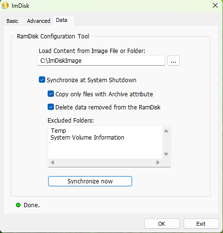

Click "Ok" button.

Following window will appear.

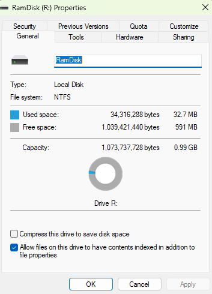

Click "Ok" button to format the RAM drive.

Click "Exit" button to quit the ImDisk configuration program.

Now, "R:\" drive will be available from the explorer.

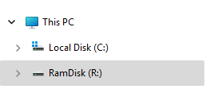
